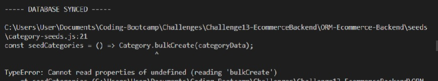
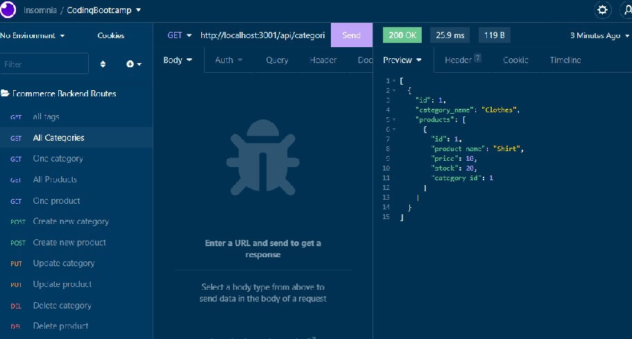
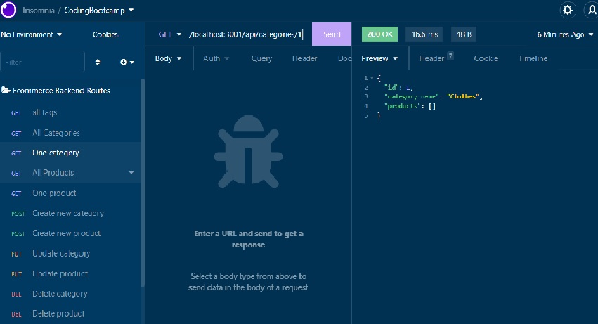
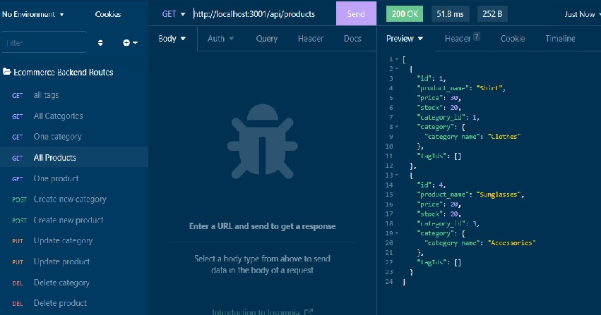

# ORM Ecommerce Backend app

## Description
This project consists of the back end for an e-commerce site. It takes a working Express.js API and configures it to use Sequelize to interact with a MySQL database.

## Usage
Please refer to the following link to view a video demo to see how the app can be used.

https://drive.google.com/file/d/1uxrgHL1QSFeI3mR6ZjhYseRs2LaTcHHw/view?usp=sharing

## Errors
I was receiving errors in the command line from the "createBulk" functions in the seed files and therefore was unable to seed any of the provided data.

## Screenshot
Below is a screenshot of the command-line prompts as well as the generated HTML rendered in the browser.

## Contributors
Beyond the starter code given to me, all contributions were made by Sara Barnett.